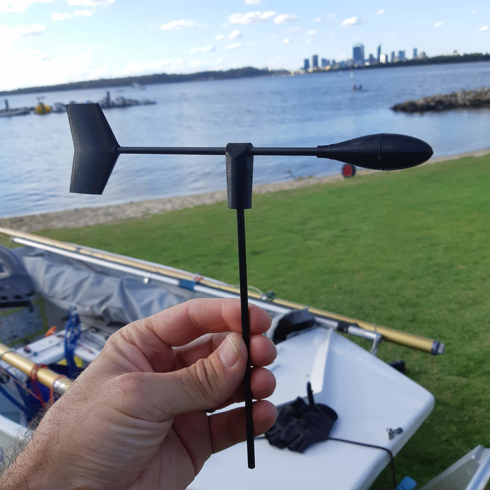

# Windy – Wind Indicator for Dinghy  
**Repo:** [3dThingsByMike](https://github.com/miiiikeb/3dThingsByMike)

---

## 📝 Summary

This is a wind-indicator I designed for my daughter's dinghy.

- It uses **4 mm diameter rods** (I used carbon) with the parts **super-glued** in place.
- The **pivot** is two separate pieces printed together — they cannot be separated after printing.  
  You’ll need to give them a gentle push with the rod to **crack them apart**, after which they should spin freely.
- **Assembly tip**: make sure the **center of mass is balanced** over the pivot by sliding the rod back and forth until there is **no rotation** when the indicator is held off vertical.  
  (If not, it will give misleading readings when the boat is heeled.)

### 🛠 Print-specific Notes

- **Nose:** Print with **100% infill**  
- **Tail:** Print with **5–15% infill**

Enjoy 🙂

---

## 🖨 Print Settings

- **Printer Brand:** Prusa  
- **Printer Model:** i3 MK3  
- **Rafts:** No  
- **Supports:** No  
- **Resolution:** As high as possible — especially for the pivot  
- **Infill:**  
  - Nose: 100%  
  - Tail: 5–15%

---
